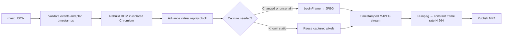

# rrweb2video

Rust library and CLI that turns an rrweb event stream into an H.264 MP4.
Chromium reconstructs and paints the recorded page, Rust controls replay time
and frame capture, and FFmpeg encodes the pixels.



Rust first validates event ordering, viewport metadata, and the presence of a
full snapshot. Event payloads remain raw JSON; the official rrweb replayer owns
DOM reconstruction. The largest recorded metadata dimensions define the capture
viewport.

Each render launches Linux `chrome-headless-shell` with a fresh temporary
profile and loads local rrweb assets. The event stream is transferred once in
batches using `JSON.parse`, avoiding one large JavaScript object-literal program.
rrweb rebuilds the initial DOM, then applies mutations, scrolls, and pointer
movement as playback advances.

Rust chooses each replay timestamp from the output frame index:

```text
replay_time_ms = min(frame_index × 1000 × speed / fps, replay_duration_ms)
```

The final sample includes the terminal replay state. A virtual clock replaces
`Date.now`, `performance.now`, animation callbacks, and timers in the player
page. Playback advances only when Rust tells it to, so a busy CPU slows the
conversion without making the player skip ahead according to wall time.

When pixels need capturing, Rust calls CDP
`HeadlessExperimental.beginFrame`. Chromium explicitly renders a compositor
frame and returns its JPEG. Capture completes before replay advances again.
This requires Linux headless Chromium with BeginFrameControl support.

After two consecutive identical captures, the renderer can reuse pixels while
the page remains known to be static. Observers track replay events, DOM changes,
shadow roots, iframes, resource loading, and fonts. Changes invalidate the cache;
dynamic or unfamiliar resources keep capture active on every frame. Idle ticks
can run in a single CDP call, while still executing every logical timer and
animation callback tick.

Rust sends JPEGs with timestamps through a streaming Matroska transport. A
bounded writer thread and three recycled buffers overlap pipe writes with
capture; backpressure limits how far rendering can advance. Frames stay in
memory throughout the pipeline.

FFmpeg decodes incoming JPEGs, pads odd dimensions, and converts to `yuv420p`.
Its frame-rate filter fills unchanged intervals before H.264 encoding, preserving
the complete output frame sequence without repeatedly decoding the same JPEG.
Encoding uses x264 with the `veryfast` preset, CRF 23, and
`zerolatency` tuning to avoid lookahead/B-frame and frame-thread buffering. This
trades compression efficiency for lower memory usage without changing capture
dimensions or frame count. Decoder, filter, and encoder thread budgets are
computed from the container's available CPU parallelism for each recording,
including CPU quota/affinity where supported. They scale with the deployment;
one thread is the fallback if the platform cannot report capacity.

The MP4 is written to a temporary file and published only after FFmpeg succeeds.
Existing output files are never overwritten. Completion or failure releases the
browser, encoder process, and temporary profile. The library returns the output
path, frame count, duration, and stage timings in `RenderReport`.

The current renderer blocks external resources, so remote stylesheets, images,
and fonts are absent unless embedded in the recording. CSS animations,
transitions, smooth scrolling, cursor effects, and caret blinking are disabled.
Canvas replay and audio are unsupported. The virtual clock controls the outer
player; arbitrary iframe or media clocks and pixel identity across browser
versions are outside the current guarantees.

`render_discard` performs the same capture and H.264 encoding but streams a
fragmented MP4 to `/dev/null`. It creates no video file or full-video buffer.
The replay-summarizer service uses this path for infrastructure measurements.
`render_discard_owned` additionally releases Rust event payloads as Chromium
receives them; `Replay::from_events` accepts raw events without a JSON round trip.
